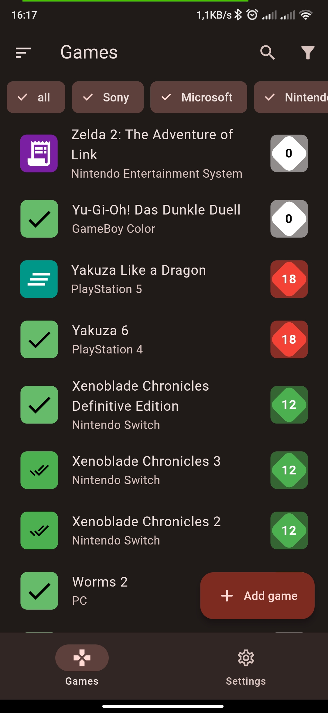
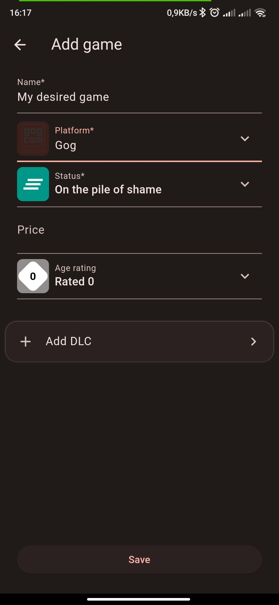
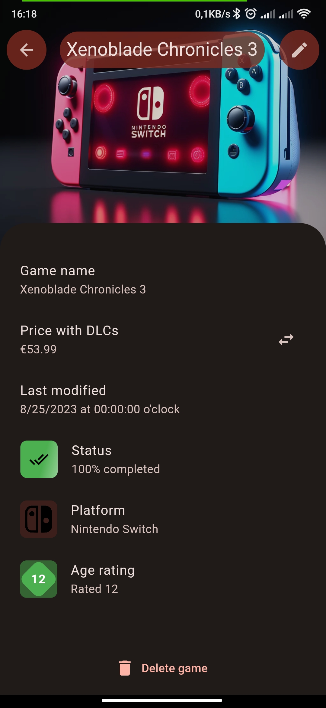
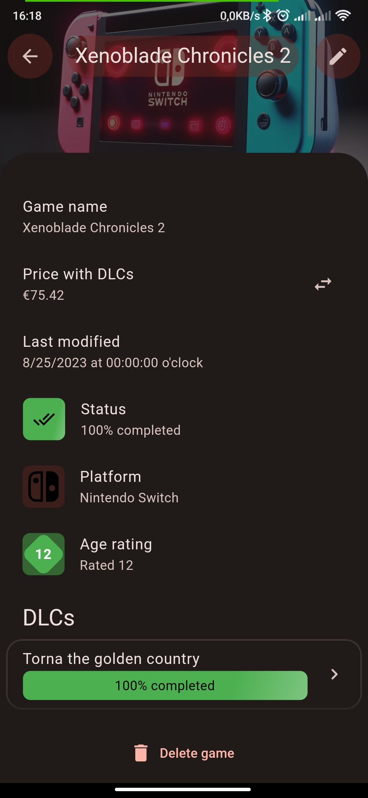

# pile_of_shame

A simple offline list for games you want to play, are playing, or played in the past.
Written in Flutter.

[](https://pub.dev/packages/lint)

## Setup
Make sure to generate some files before hitting run.
For conveninence, the script `scripts/init_project.py` will perform these actions in the order listed here.
1. Fetch the dependencies of the project by running `flutter pub get`
2. Generate localizations using `flutter gen-l10n`
3. Generate other files by running `dart run build_runner build --delete-conflicting-outputs`

## Localization (l10n)
Localization uses flutter's l10n generator.
To add or update the localization of the application, edit the .arb-File of your desired language in `lib/l10n`.
New keys have to be added to all supported languages.

Once the text has been updated, generate the localization using
```bash
flutter gen-l10n
```

## Continuous deployment
Deployment for Android is managed with fastlane in github actions automatically.

## Testing

### Unit tests
```bash
flutter test
```

### Appium integration tests
This project uses appium to run integration tests on real devices or emulators.
You will have to install appium and its drivers seperately.

#### Setup
The appium project is located at `test/appium/`. To initialize that project, run this command there (which requires `node` to be installed)
```bash
npm install
```

The easiest way to work with appium is by installing the appium server globally:
```bash
npm i --location=global appium
```

Next up, we install the drivers for Android and iOS as well as Flutter
```bash
# Android driver
appium driver install uiautomator2
# iOS driver, only available on macOS
appium driver install xcuitest
# Flutter driver
appium driver install --source=npm appium-flutter-driver
```

You can check which drivers are installed on your machine using
```bash
appium driver list
```

#### Testing
The application has to be built with the dart definition `FLUTTER_APPIUM_TEST=true` in order to include the required library for flutter_driver. VSCode defines a build-target for that.

To run all tests, run these commands in different terminals.
```bash
appium
```
As soon as the appium server is running and ready to receive requests, run the tests for your platform of choice like this:
```bash
# working directory has to be test/appium/
npm run test-android
```

You might have to adjust the config for your platform, as the name of the device/emulator is specified there.
Have a look at [the Android config](./test/appium/configs/wdio.android.conf.js) and [the iOS config](./test/appium/configs/wdio.ios.conf.js).

## Download the App

<div style="width: 200px">
    <a href='https://play.google.com/store/apps/details?id=org.philipp_guertler.pile_of_shame&pcampaignid=web_share&pcampaignid=pcampaignidMKT-Other-global-all-co-prtnr-py-PartBadge-Mar2515-1'></a>
</div>

## Screenshots

<p align="center">
    
    
</p>
<p align="center">
    
    
</p>