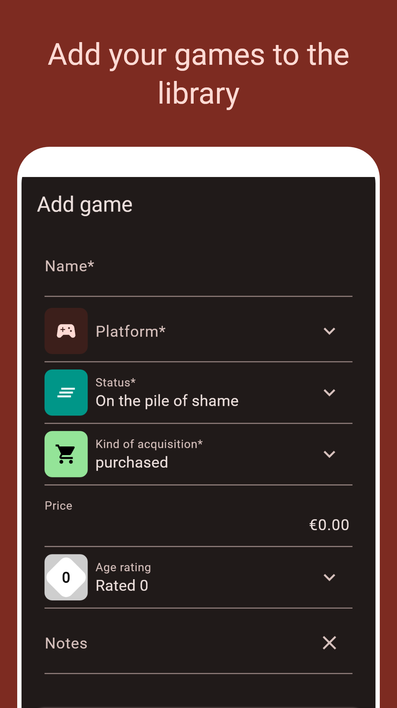
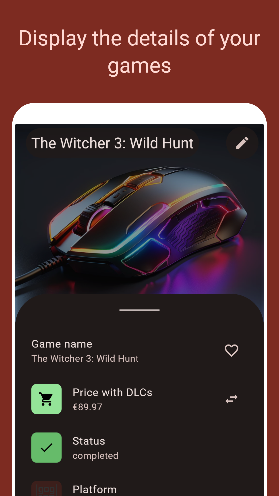
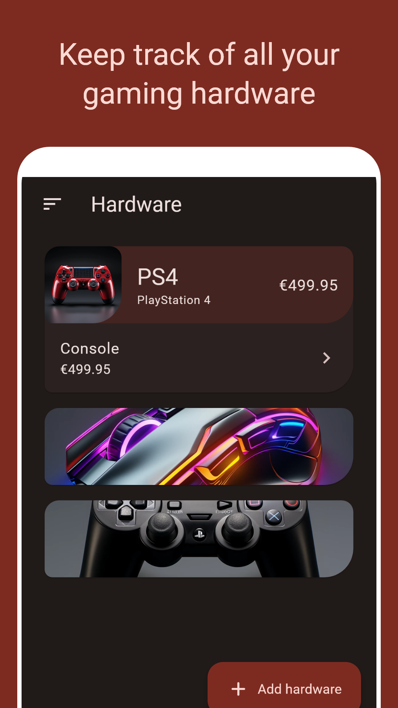
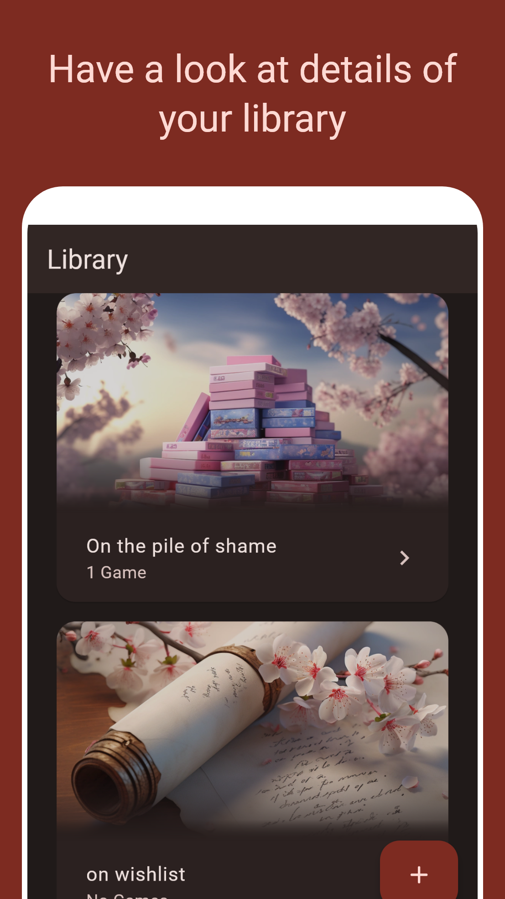
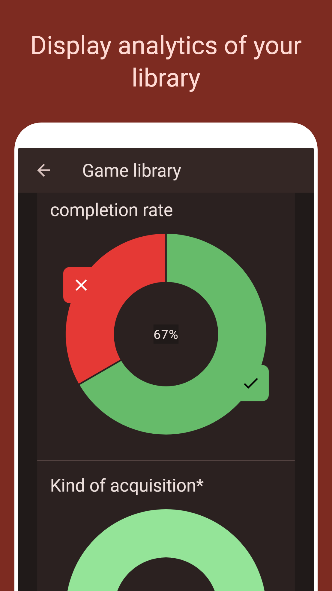

# pile_of_shame

A simple offline list for games you want to play, are playing, or played in the past.
Written in Flutter.

[](https://pub.dev/packages/lint)

## Setup
This project relies on a git submodule.
Don't forget to fetch it before attempting to build the application:
```shell
git submodule update --recursive
# if this is the first time you check out this repo, add --init
git submodule update --init --recursive
```

Make sure to install the latest [Flutter SDK](https://docs.flutter.dev/get-started/install) and set it up.

Before building, you will have to generate some files before hitting run.
For conveninence, the script [`scripts/init_project.py`](scripts/init_project.py) will perform these actions in the order listed here.
1. Fetch the dependencies of the project by running `flutter pub get`
2. Generate localizations using `flutter gen-l10n`
3. Generate other files by running `dart run build_runner build --delete-conflicting-outputs`

Steps 1 and 3 have to be done in each subdirectory of `packages`.
Again, [`scripts/init_project.py`](scripts/init_project.py) will perform these actions for convenience.

## Localization (l10n)
Localization uses flutter's l10n generator.
To add or update the localization of the application, edit the .arb-File of your desired language in `lib/l10n`.
New keys have to be added to all supported languages.

Once the text has been updated, generate the localization using
```shell
flutter gen-l10n
```

## Continuous deployment
Deployment for Android is managed with fastlane in github actions automatically.

## Testing
Unit tests can be run using this command:
```shell
flutter test
```

## Generating screenshots
The testing library golden toolkit is used to auto-generate screenshots for the play store entry.
Simply run `scripts/generate_screenshots.py` to re-generate them.

## Download the App

<div style="width: 200px">
    <a href='https://play.google.com/store/apps/details?id=org.philipp_guertler.pile_of_shame&pcampaignid=web_share&pcampaignid=pcampaignidMKT-Other-global-all-co-prtnr-py-PartBadge-Mar2515-1'></a>
</div>

## Screenshots

<p align="center">
    
    
</p>
<p align="center">
    
    
<p align="center">
    
    
</p>