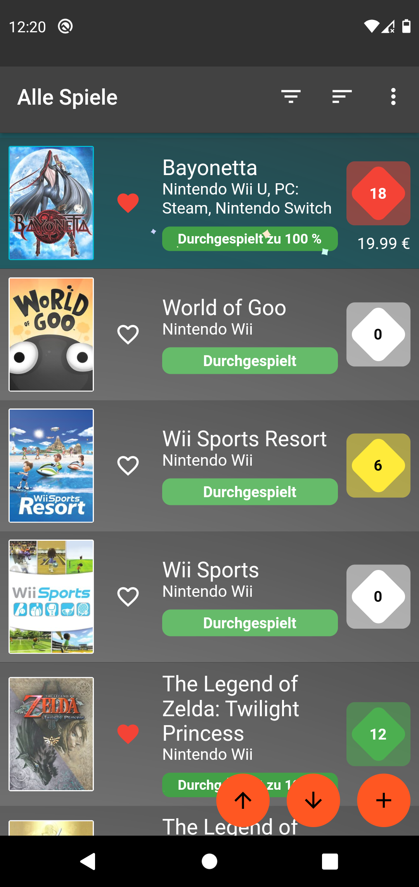
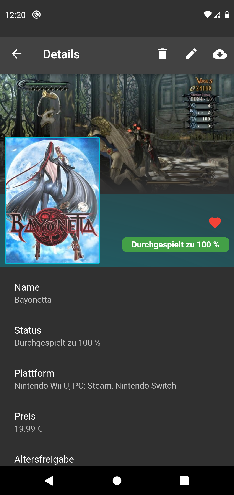

# Pile of Shame

## Introduction
This project is intended as a hands-on learning project for flutter.
It will result in an application that simply displays information about games the user has registered and played, as well as information about games the user intends to play.

 

## Implemented features
- Displaying a list of games on the main page is working fine.
- Persisting a list of games in a local file is working.
- Adding a new game to the list of existing games is working.
- Deleting a game is working.
- Scraping data for single games using RAWG.io is working.
- Saving scraped data for games is implemented and working.
- Editing Game-Info (and subsequent persisting) is implemented
- Sorting games by name, platform, price, age-restriction, release-date, favourite is implemented
- Favourite-functionality is implemented with a fancy animation.
- Exporting/Importing stored games as a json to a location of the user's choosing is implemented
- Filtering games by platform, age-restriction, state and favourites is implemented
- All currently visible games can now be scraped at once
- If multiple games are found during scraping in the details, a list of options will be displayed

## TODOs
- Saving platforms entered by the user in a json file and retrieving them from there has to be implemented. The list/file should be initialized with a bunch of known platforms (see game_addition.dart)
- cleanup code
- Add a search
- Add the option to select multiple platforms, etc. in the filters
- Add Graphs and Analytics

## Known issues
- Sometimes the app crashes at special keyboard-inputs like the arrow-keys or backspace when adding a game during debugging (sporadically)
- Focus on Editing and Adding games is weird when new platforms get added on the fly. Maybe this can be fixed by adding platforms using an add-button.
